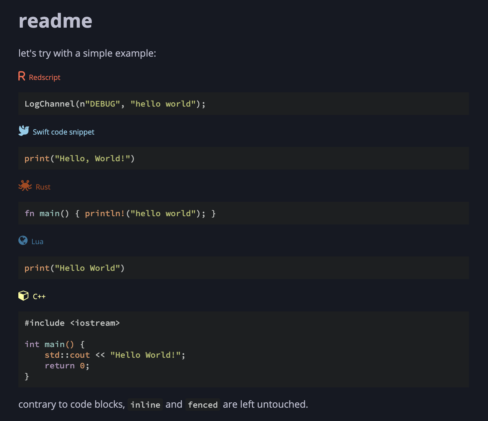

# mdbook-codeblocks

 [](https://crates.io/crates/mdbook-codeblocks)

A preprocessor for [mdbook](https://rust-lang.github.io/mdBook/) which prepend a vignette above code blocks.

## usage

First you need to install the pre-processor by running the following command.

```sh
cargo install mdbook-codeblocks
```

Next you need to add the preprocessor to your `book.toml`. Customization is at its early stage, but you can already define language's custom `icon`, `label`, `color` and `link`:

```toml
[book]
authors = ["Roms1383"]
title = "Code blocks preprocessor example"

[output.html]

[preprocessor.codeblocks]
renderers = ["html"]
cpp = { color = "#FFFF99", link = "https://wiki.redmodding.org/red4ext" }
redscript = { color = "tomato", link = "https://wiki.redmodding.org/redscript" }
rust = { color = "#ac4313", link = "https://github.com/jac3km4/red4ext-rs" }
lua = { link = "https://wiki.redmodding.org/cyber-engine-tweaks" }
swift = { label = "Swift code snippet", color = "skyblue" }
```

Here's what it will produce:



You can actually find it in `example` folder.

⚠️ also, do not forget to embed [FontAwesome css](https://cdnjs.com/libraries/font-awesome), see `example/theme/head.hbs`.

## roadmap

This tool is very rudimentary, but contributions are welcomed!

Especially for the HTML/CSS :)

Likewise it only supports a small subset of 5 languages so far, please add more!

## attribution

This tool uses icons from [FontAwesome](https://fontawesome.com/) by default.
